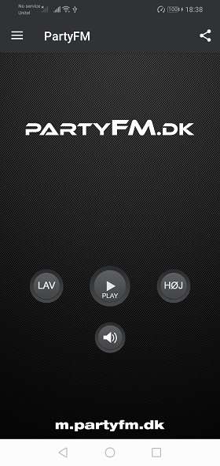
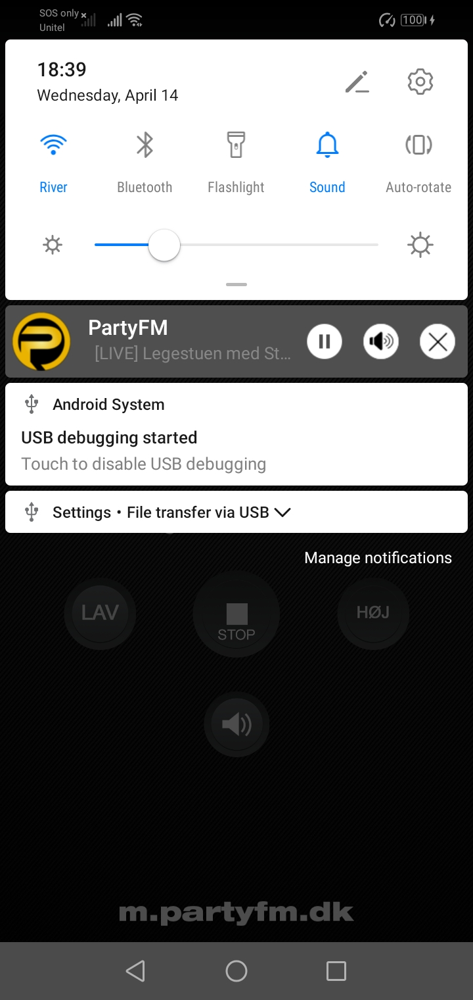
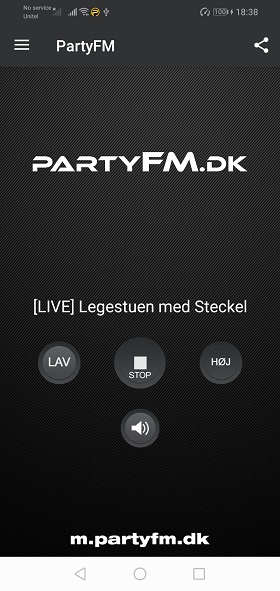

# AudioLiveStreaming-Android

https://play.google.com/store/apps/details?id=com.partyfm.radio

### Get Started

You can change the live stream url in this folder.

app/src/main/java/com/partyfm/radio/Config.java:

public static final String RADIO_STREAM_URL_LOW = "http://yourstreamurl";

## Screenshot

|                Screenshot               |                 Screenshot            |               Screenshot              |
|:---------------------------------------:|:-------------------------------------:|:-------------------------------------:|
|    |      |    |

Screenshot
  
